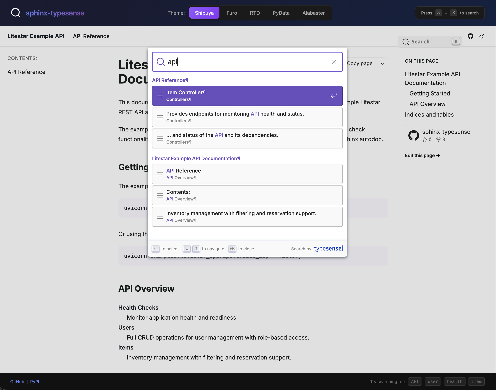

sphinx-typesense
================

A Sphinx extension for integrating Typesense search into documentation sites.

Replace Sphinx's built-in search with Typesense for fast, typo-tolerant search
that scales from small projects to large documentation portals.

.. grid:: 2
   :gutter: 3

   .. grid-item-card:: Getting Started
      :link: getting-started/index
      :link-type: doc

      Install sphinx-typesense and configure your first search integration
      in minutes.

   .. grid-item-card:: Search Backends
      :link: backends
      :link-type: doc

      Choose between Typesense (server-based) and Pagefind (static) search
      backends, or let auto-selection pick the best option.

   .. grid-item-card:: Configuration
      :link: configuration
      :link-type: doc

      Complete reference for all configuration options including server
      settings, search UI customization, and theme support.

   .. grid-item-card:: Theme Support
      :link: themes
      :link-type: doc

      Learn about supported Sphinx themes and how to add support for
      custom themes.

   .. grid-item-card:: API Reference
      :link: api/index
      :link-type: doc

      Detailed API documentation for all modules, classes, and functions.

Features
--------

- **Dual Backend Support**: Choose Typesense (server) or Pagefind (static) search
- **Fast Search**: Typesense provides sub-50ms search responses
- **Typo Tolerance**: Built-in typo correction (configurable 0-2 typos)
- **Zero-Config Static Search**: Pagefind backend works on any static host
- **Build-time Indexing**: Automatic content extraction during Sphinx builds
- **DocSearch Compatible**: Uses the DocSearch hierarchical schema for familiar UX
- **Multiple Theme Support**: Works with RTD, Furo, Alabaster, PyData, and Book themes
- **Self-hosted or Cloud**: Supports both Typesense Server and Typesense Cloud

Quick Example
-------------

Add to your Sphinx ``conf.py``:

.. code-block:: python

   extensions = ["sphinx_typesense"]

   # Typesense server connection
   typesense_host = "localhost"
   typesense_port = "8108"
   typesense_protocol = "http"

   # API keys (use environment variables in production)
   import os
   typesense_api_key = os.environ.get("TYPESENSE_API_KEY", "")
   typesense_search_api_key = os.environ.get("TYPESENSE_SEARCH_API_KEY", "")

Build your documentation and the search index will be automatically created.

.. toctree::
   :maxdepth: 2
   :hidden:
   :caption: User Guide

   getting-started/index
   backends
   configuration
   themes
   security

.. toctree::
   :maxdepth: 2
   :hidden:
   :caption: Reference

   api/index

.. toctree::
   :maxdepth: 1
   :hidden:
   :caption: Project

   changelog
   GitHub Repository <https://github.com/JacobCoffee/sphinx-typesense>
